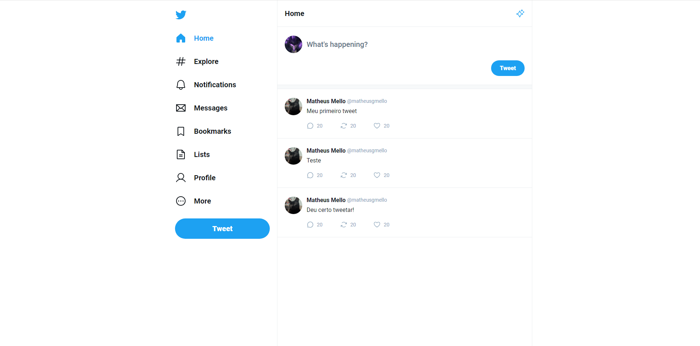

Este projeto é um clone da interface (UI) do Twitter, desenvolvido com React, com o propósito de aprimorar conhecimentos na tecnologia por meio de estudos educacionais.

# Configurações 

### Requisitos
- [Node.js](https://nodejs.org/en/)

**Clone o projeto e acesse a pasta**

```bash
git clone git@github.com:matheusgmello/react-ui-twitter.git && cd react-ui-twitter
```
**Siga estes passos**

- Instalar dependências (`npm install`)
- Rode a aplicação (`npm run dev`)

## Tecnologias

- [React](https://react.dev/)
- [TypeScript](https://www.typescriptlang.org/docs/)
- [Vite](https://vitejs.dev/)

<!--START_SECTION:footer-->
<br />

## 🔗 Connect with me
[](https://linkedin.com/in/matheusgmello)
[](https://www.reddit.com/user/math7zw)
[](https://github.com/matheusgmello/)


<!--END_SECTION:footer-->